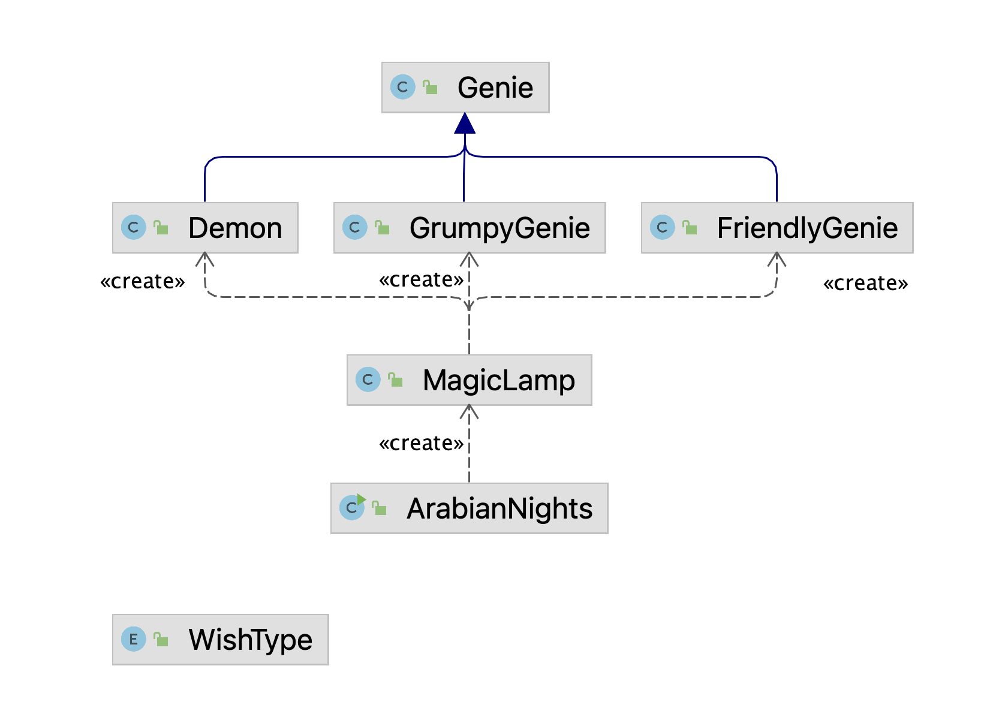

# 🧞‍♂️ The Java Lamp

This project involves creating a Java program that simulates a Magic Lamp following Object-Oriented Programming (OOP) principles. It uses inheritance, polymorphism, and composition to meet the client's requirements, inspired by the "Arabian Nights" tales.

## Goal

Create a Java program that follows the OOP paradigm and meets the client's specifications by applying inheritance and polymorphism to efficiently reuse code.

## Skills

By completing this assignment, you will:

- Understand and apply the concept of inheritance to improve code reusability.
- Create Java classes using composition.
- Work with Java `Enum` types to manage a set of constants.
- Utilize the `super` keyword to refer to superclass methods and constructors.
- Apply polymorphism to handle objects of different types in a unified manner.
- Build and package your program using Apache Ant.

## Client Requirements

### Magic Lamp

- **Genie Creation**: The Magic Lamp releases a new genie every time it is rubbed.
- **Genie Types**: Genies can be Friendly, Grumpy, or a Demon.
- **Genie Limits**: The maximum number of genies is set when the lamp is enchanted or instantiated.
  - **Friendly Genie**: Handles good wishes.
  - **Grumpy Genie**: Has a chance of destroying the lamp and handles both good and bad wishes.
  - **Demon**: Handles only bad wishes and is released when all other genies are exhausted.
- **Recharging**: The lamp can recharge itself by recycling a Grumpy Genie or a Demon. There is a maximum number of times it can be recharged.
- **Comparison**: The program should allow for creating multiple lamps and comparing them based on the number of genies they can create, remaining genies, and the number of times they have been recharged.

### WishType Enum

- **Wish Types**: The `WishType` Enum defines the types of wishes that can be granted:
  - **Good Wishes**: WEALTH, FAME, LUCK.
  - **Bad Wishes**: POOR, SICKNESS, BAD_LUCK.
- **Descriptions**: Each wish type has an associated description that will be printed when the wish is granted.

### Genies

#### FriendlyGenie

- **Wish Limits**: Can grant a set number of good wishes, one at a time, and only if the maximum limit is not reached.
  
#### GrumpyGenie

- **Wish Limits**: Grants only one wish, either good or bad, with a 50% chance for each.
- **Recycling**: Can recharge the Magic Lamp if recycled, but has a 50% chance of destroying it. It can only be recycled once and cannot grant any more wishes after recycling.

#### Demon

- **Wish Limits**: Grants all wishes, even exceeding the maximum limit, but only bad wishes.
- **Recycling**: Can recharge the Magic Lamp if recycled and can only be recycled once. It cannot grant any more wishes after recycling.

### UML Diagram

The UML diagram below provides a structural overview of the classes involved:



## Build and Package

To distribute the program, package it into a .jar file using Apache Ant. Below is an overview of the Ant build process:

## Installation

Clone the repository and navigate to the folder.

```bash
git clone <repository-url>
cd <repository-folder>
```

## Usage

To run the Java program:

```bash
java -jar dist/java-lamp.jar
```

## Contributing

Pull requests are welcome. For major changes, please open an issue first to discuss what you would like to change.

Please make sure to update tests as appropriate.

## Suggested future improvements
?
